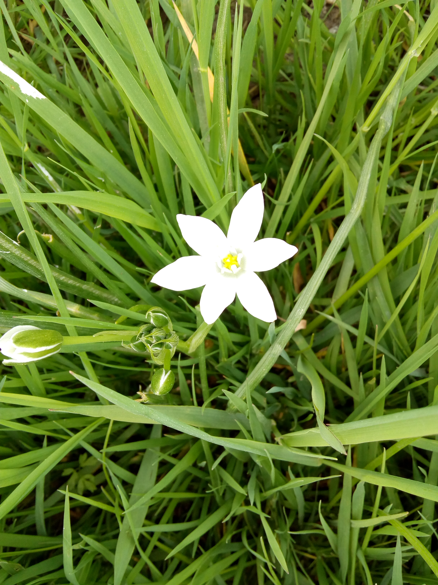

# BIOBLOG

Dit is een project begonnen in januari 2024. Dedicated to my biodiversity
blog, software and content. Het kader is de werkgroep Biodiversiteit van de 
gemeente West Maas en Waal, de partij Sociaal Maas en Waal, het praktijknetwerk van 
van landeigenaren voor biodiversiteit van de Stichting Landschapsbeheer 
Gelderland (SLG) en het lidmaatschap van het IVN.

## Installing / Getting started
---

### Initial Configuration
I use ssh key pairs with passphrase to work from different computers,
so I guess you could too.

## Developing
Have and change to an empty directory:
```shell
https://github.com/Treurwilg/bioblog.git
```

### Building
Too simple to speak about building

### Deploying / Publishing
I simply copy files to the root of the site with my provider.

## Features
* Main functionality: 
** Showing pictures and stories
** Submit pictures and stories
** Provide scientific, legal and practical information
---

## Configuration
---

## Contributing
This is a private enterprise, I want to learn from 
it and serve the local biodiversity community,
but anyone with ideas on the subject is welcome.

## Links
* A guide for me is:
[codewithawa](https://codewithawa.com/posts/how-to-create-a-blog-in-php-and-mysql-database)
* As guide for readme: [readme-best-practices](https://github.com/jehna/readme-best-practices/blob/master/README.md)
* I show the result on [mySite](https://ict4us.nl/bioblog) which also is the project homepage.

## Licensing
["The code in this project is licensed under Creative Commons Zero v1.0 Universal."]
(https://github.com/Treurwilg/bioblog?tab=CC0-1.0-1-ov-file#readme)
